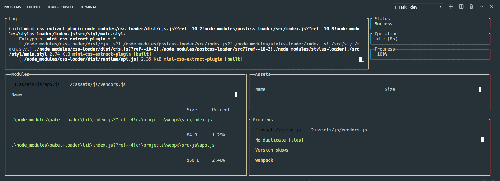
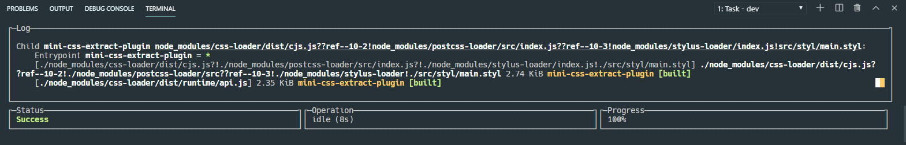

#  Webpack template for simple layouts
----------
package.json 
```json
"scripts": {"dev": "webpack-dashboard -c -t ...
```


----------
package.json 
```json
"scripts": {"dev": "webpack-dashboard -c -m -t ...
```


----------
```npm run dev``` - for start work <i>(with webpack-dashboard)</i> :fire:

```npm run build``` - for start build

----------

## Dependencies

>  jQuery

>  lazyload

>  reset-css

----------

###### 💬 How to use lazy image loading 💬
- use the code below without changing "src"
- put a patch to an image to data-src=" "

html
```html

```
app.js
```javascript
  lazyload();
```


###### 💬 How to use svg sprites 💬
- put the name of the SVG file in "href" after #

```html
<svg><use xlink:href="#"></use></svg>
```
